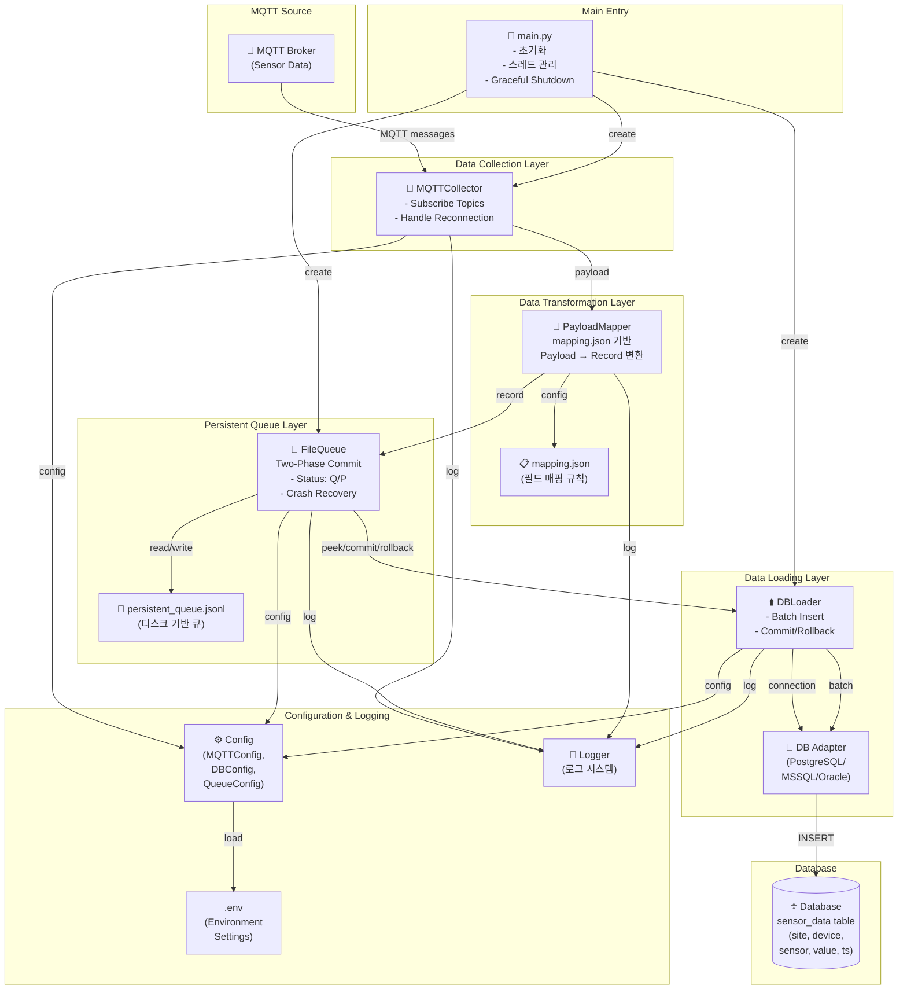

# ITIS_Collector_MQTT

ITIS_Collector_MQTT는 반도체 소성로 장비의 센서 데이터를 ITIS Capture를 통해 수집하고, MQTT 브로커를 거쳐 데이터베이스에 적재하는 견고한 데이터 파이프라인 시스템입니다. 파일 기반의 영속적 큐(Persistent Queue)를 사용하여 데이터의 무결성을 보장합니다.

## 데이터 흐름  
```
MQTT Message
    ↓
[Collector] → append() → FileQueue (status: "Q")
    ↓
[Loader] → peek() → status: "Q" → "P"로 변경
    ↓
Database INSERT 시도
    ├─ 성공 → commit() → "P" 라인 제거
    └─ 실패 → rollback() → "P"를 "Q"로 복구 → 재시도
```

## 시스템 구성도  


## 주요 모듈별 역할  
| 모듈 | 설명 |
|------|------|
| `main.py` | 프로그램 진입점. `MQTTCollector`와 `DBLoader` 스레드를 생성 및 관리하고, 종료 신호(SIGINT, SIGTERM)를 처리한다. |
| `mqtt_collector.py` | MQTT 브로커를 구독하여 메시지를 수신하고, 예외를 처리한 뒤 데이터를 큐에 저장한다. |
| `data_mapper.py` | `mapping.json` 설정을 기반으로 MQTT Payload를 DB 레코드 형식으로 변환한다. |
| `file_queue.py` | 영속적(Persistent) 파일 큐를 제공하며, 2단계 커밋(`Queue → Processing → Commit/Rollback`)을 지원한다. |
| `loader.py` | 큐에서 레코드를 배치 단위로 읽어 데이터베이스에 INSERT하며, DB 연결 재시도 기능을 제공한다. |
| `config.py` | `.env` 파일에서 MQTT, DB, Queue, Loader 등의 설정을 로드한다. |
| `logger.py` | 애플리케이션 전반에서 사용하는 통합 로깅 시스템을 제공한다. |

## 프로젝트 구조
```text
ITIS_Collector_MQTT/
├── main.py              # 메인 루프 및 파이프라인 제어
├── mqtt_collector.py    # MQTT 데이터 수집
├── data_mapper.py       # 데이터 변환 로직
├── file_queue.py        # 영속적 큐 관리
├── loader.py            # DB 적재 모듈
├── logger.py            # 로그 시스템
├── mapping.json         # 매핑 규칙 정의
├── .env.example         # 환경 설정 템플릿
├── requirements.txt     # 의존성 패키지 목록
├── mqtt_test_publisher.py # 테스트용 데이터 발행기
└── tests                # pytest 테스트를 위한 폴더
```

## 환경 설정(.env)  
모든 주요 설정은 `.env` 파일을 통해 관리됩니다. 주요 항목은 다음과 같습니다:  
* **MQTT**: 서버 주소, 포트, 토픽 정보  
* **PG(Persistent Queue)**: 큐 파일 경로, 최대 파일 사이즈, 제한 여부.  
* **DB**: 데이터베이스 타입(MsSQL, Oracle, PostgreSQL 등)및 서버 접속 정보.  
* **Loader**: 데이터 적재 시 재시도 횟수 및 배치 사이즈.  
* **로그**: 로그 레벨, 파일 크기, 보관 개수 제한 및 저장 경로.  
* **Mapper**: 페이로드 매핑 규칙.  

## 설치 및 시작하기
### 1. 환경 설정  
프로젝트를 복제하고 필요한 라이브러리를 설치합니다.  
``` text  
git clone [https://github.com/Jian-02/ITIS_Collector_MQTT.git](https://github.com/Jian-02/ITIS_Collector_MQTT.git)
cd ITIS_Collector_MQTT
pip install -r requirements.txt
```  
### 2. 설정  
`.env.example` 파일을 복사하여 `.env` 파일을 생성하고, 사용하는 MQTT 브로커 정보를 입력하세요.  
```text  
cp .env.example .env
```  
### 3. 실행  
모든 설정이 완료되었다면 아래 명령어로 수집기를 시작합니다.  
```text
python main.py
```  

## MQTT Publisher 테스트 (개발용)  
`mqtt_test_publisher.py`를 사용하여 가상의 데이터를 발생시켜 시스템을 테스트할 수 있습니다.  
```text
# 기본 실행
python mqtt_test_publisher.py

# 옵션 설정 예시
python mqtt_test_publisher.py --count 50 --interval 0.5
python mqtt_test_publisher.py --host localhost --port 1883
```  
위 스크립트는 `.env`의 `MQTT_HOST / MQTT_PORT`를 사용하며, `factory/line1/temp` 등 지정된 토픽으로 `mapping.json` 형식에 맞는 랜덤 페이로드를 발행합니다.  

## 운영 가이드 및 트러블 슈팅  
### 1. MQTT Brocker 실행  
테스트 환경에서는 Mosquitto 브로커를 다운받아, 아래 명령어를 통해 디버그 모드로 실행할 수 있습니다.
```
Mosquitto.exe -v
```  
`Publisher` -> `Mosquitto (1833 port)` -> `Collector` 순으로 데이터가 전송됩니다.  
  
### 2. 주요 이슈 및 대응  
* **Brocker 연결 재시도**: Mosquitto가 종료된 경우, Collector는 설정된 폴링(Polling) 시간이 돌아올 때까지 재연결을 대기합니다.(폴링 시간 조절로 연결 공백 최소화 가능)  
* **DB 연결 실패 시**: DB접속 장애가 발생하면 수신된 데이터를 PQ(Persistent Queue)파일에 임시 저장합니다. DB 연결이 복구되면 PQ에 쌓인 데이터를 한 번에 가져와(Pulling) 적재합니다.  

## 라이선스  
본 프로젝트는 MIT License 를 따릅니다.  